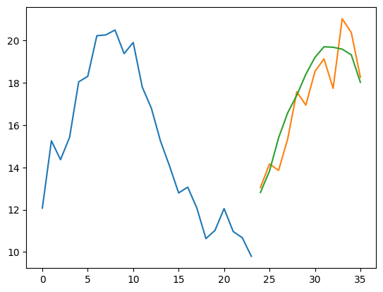

# Spatial and Point Wind Speed Forecasting Using Machine Learning

## Overview and aim of the model
This project uses machine learning techniques to forecast spatial wind speed in South Africa. The aim is to use historical wind speed data to create predictive models to predict future wind speed patterns.

- Create a point-point ML model to predict the day-ahead wind speed at a certain location.
- Create a spatial-spatial ML model to predict the day-ahead spatial wind speeds for a given area.

- Compare the two methods to find which method would yield the most accurate results.

## Related Work
The project builds upon the following research:

- **UNets**: 
  - [WF-Unet](https://arxiv.org/abs/2302.04102)

- **Transformers**: 
  - [Pangu-Weather](https://arxiv.org/abs/2211.02556) , [FengWu](https://arxiv.org/abs/2304.02948)

- **Graph Neural Networks**: 
  - [NeuralLAM](https://arxiv.org/abs/2309.17370) , [Keisler](https://arxiv.org/abs/2202.07575) , [GraphCast](https://arxiv.org/abs/2212.12794)
 
- **Multi-Layer Perceptron**:
  - Own implementation for benchmarking purposes 

## Data Description
- **Source**: ERA5 wind speed data for South Africa (2018-2023).
    - Includes: `humidity`, `temperature`, `u-wind`, `v-wind`, `w-wind`
- **Format**: Data is stored as a .nc file and opened using xarray and converted to .csv files for the point-point models.
- **Format**: Data converted to .npy files for spatial-spatial forecasts.
- **Shape**: The dataset has the following shape: `[time_steps, latitude, longitude, variables]` relating to `~ [35000, 34, 71, 5]`.

## Data Processing
1. **Dataset Class**: A custom weather data class is used to perform the following:
    - Load data
    - Calculate wind speed (`wspd`) and wind direction (`wdir`)
    - Normalize data and convert to tensor
    - Provide the `features` and `targets` to a dataloader for training, validation, and testing.
   
2. **Feature Extraction**:
   - **Features**: Previous `n` steps based on the `window_size`.
   - **Forcings**: Current hour of the day and month of the year at the time of prediction (not included at the moment).
   - **Target**: The `m` number of forecasting steps based on the defined `steps` variable.

## Model Descriptions

### Simple MLP Model
- **Model Structure**: Simple MLP model that has an _input size_ of `window_size x variables`, _hidden size_ of `hidden_size` and _outpud dim_ of `step_size`

- **Input**: Previous `n` steps based on the `window_size`.
    - Relates to an input shape of `[batch_size, window_size, variables]` -> `[32, 48, 6]`
- **Target**: The `m` number of forecasting steps based on the defined `steps` variable.
    - Relates to an output shape of `[batch_size, step_size]` -> `[32, 24]`

#### Model usage:

- **Direct preediction**: Doesn't make use of auto-regressive prediction, rather predicts the `m` number of steps directly.
- **Auto regressive rollout prediction**: Predicts one time step at a time and uses the output from the model as input to the next model. (not used currently due to multi-variate forecasting)

#### Model training:

This training loop is designed for a PyTorch model using Mean Squared Error (MSE) loss, an Adam optimizer, learning rate scheduling, early stopping, and Weights & Biases (wandb) logging.

---

##### Initialize Training Configuration
1. **Define Training Parameters**: `n_epochs`, `warmup_epochs`, `initial_lr`, `early_stopping_patience`, and `checkpoint_path`.
2. **Set Device** (e.g., GPU or CPU) if available.

---

##### Model Setup
1. **Loss Function**: Use MSE Loss.
2. **Optimizer**: Adam with an initial learning rate of `initial_lr`.
3. **Learning Rate Scheduling**:
   - Define a **Warmup Scheduler** with a lambda function:
     - Gradually increases learning rate for `warmup_epochs`.
   - Use **Main Scheduler (ReduceLROnPlateau)** after warmup to reduce learning rate when validation loss plateaus.

4. **Early Stopping Variables**:
   - Set `best_val_loss` to infinity as a starting point.
   - Initialize a `patience_counter` to track early stopping progress.

---

##### Training Loop
- **For each epoch (up to `n_epochs`)**:
  - **Training Phase**:
    1. Set the model to training mode.
    2. Initialize `epoch_loss` to accumulate training loss.
    3. **For each batch in `train_loader`**:
       - **Retrieve Batch**: Get `x` (input) and `y` (target output).
       - **Move to Device**: Send `x` and `y` to GPU/CPU if applicable.
       - **Forward Pass**: Predict `y_pred` using the model.
       - **Calculate Loss**: Use `criterion` (MSE Loss).
       - **Backward Pass**: Compute gradients and clip if necessary.
       - **Optimizer Step**: Update model parameters.
       - Print batch loss every 100 batches.

    4. **Log Average Training Loss** at the end of each epoch.

  - **Validation Phase**:
    1. Set the model to evaluation mode.
    2. Initialize `val_loss`.
    3. **For each batch in `val_loader`**:
       - Retrieve batch `val_x` and `val_y`, and move to device.
       - Compute predictions and validation loss without gradients.
    4. **Calculate Average Validation Loss**.

  - **Learning Rate Adjustment**:
    - Apply warmup scheduler for initial epochs.
    - Use ReduceLROnPlateau scheduler based on validation loss for the remaining epochs.
    - Log the current learning rate.

  - **Weights & Biases Logging**:
    - Log epoch-level metrics such as `train_loss`, `val_loss`, and `learning_rate`.

  - **Model Checkpointing**:
    - Save model if `avg_val_loss` improves `best_val_loss`.
    - Update `patience_counter` if no improvement.

  - **Early Stopping Check**:
    - If `patience_counter` exceeds `early_stopping_patience`, exit loop.

---

##### Post-Training
- **Load Best Model**: Reload the best checkpointed model for further evaluation or usage.
- Print completion message.

--- 

**Notes**: 
- This training loop leverages warmup scheduling for initial epochs, learning rate decay, checkpointing, and early stopping.
- Weights & Biases logging captures model performance for monitoring.

### UNet Model
- **Current Model**: A UNet model that integrates the feature states and the forcings as input.
- **Input**: The previous `n` weather states are given as images to the UNet and the forcings (hour of the day, month of the year) is also passed as input to the model.
- **Prediction Mechanism**: The PyTorch model predicts one step into the future and is utilized as an autoregressive rollout forecasting device.

#### Implementations to be tested
- **Land mass forcings**: Add a layer that identifies the land mass of South Africa
- **Training for multiple steps**: In the training, increase the number of steps that the model is training.

### Graph Convolutional Network Model
- **Encoding**: The encoder component of the GraphCast architecture maps local regions of the input into nodes of the multi-mesh graph representation (GraphCast). 
- **Processing**: The processor component updates each multi-mesh node using learned message-passing.
- **Decoding**: The decoder component maps the processed multi-mesh features back onto the grid representation.
- **Tools**: This paper shows that encoding/decoding can be done using an MLP to concatenate multiple states. 

## Issues
- **Computer crashing on PyTorch implementation**: Simulation computer with NVIDIA GeForce GPU crashing (temperature @ 73 \degrees C)
- Autoregressive rollout training not yielding the best results for UNet PyTorch Implementation

# Forecasting Experiments

This document outlines the forecasting accuracy experiments conducted for both spatial and point-based wind speed predictions. The objective is to compare the performance and accuracy of forecasting approaches across spatial grids, forecasting horizons, and individual locations within the dataset.

## Spatial Forecasts vs Point Forecasts accuracy

### Criteria for forecasting accuracy

Forecasting accuracy will be assessed based on the following criteria:

- RMSE (Root Mean Squared Error): Provides insights into the standard deviation of prediction errors, useful for more interpretable results in terms of actual wind speed units.
- Anomaly Correlation Coefficient (ACC): Measures the linear relationship between actual and predicted wind speed values, useful for identifying overall alignment.
- Spatial Consistency: Specific to spatial forecasts, evaluating the smoothness and consistency across grid cells for spatial accuracy.

### Model types to fit both cases

**Attention Transformer**: Will be used for both the point and spatial forecasts to compare the same model on similar areas to identify where the models differ. 

### Testing methodology:

**Locations**:
**Time horizons**:

